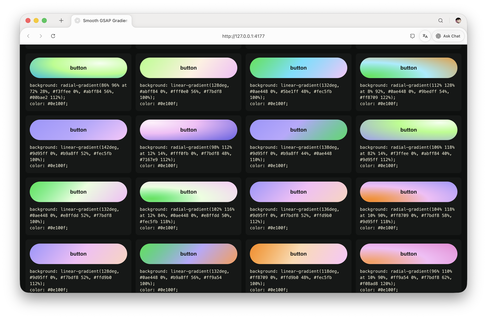

# beautiful-button

Smooth GSAP-style gradient button library. Click any button to copy its CSS parameters.

## Open The Live Page

[Open Beautiful Button](https://eliodengdeng.github.io/beautiful-button/)

This repository is connected to GitHub Pages from the `main` branch. After updates are pushed to GitHub, the live page above updates automatically. GitHub may take a short moment to rebuild and refresh the page.

## Project Files

- `渐变button/index.html` is the usable button demo file.
- `渐变button/assets/preview.png` is the visual preview.
- `渐变button/assets/demo.mov` is the screen recording.
- `index.html` redirects to the demo, so GitHub Pages can open the project from the repository root.

## How To Use

Open the interactive page here: [https://eliodengdeng.github.io/beautiful-button/](https://eliodengdeng.github.io/beautiful-button/)

GitHub's file viewer shows HTML source code, so clicking `渐变button/index.html` inside the repository is for viewing or downloading the file, not for running the page.

You can also download the repository and open `渐变button/index.html` directly in a browser.

## Demo Video

[Watch the screen recording](./渐变button/assets/demo.mov)
